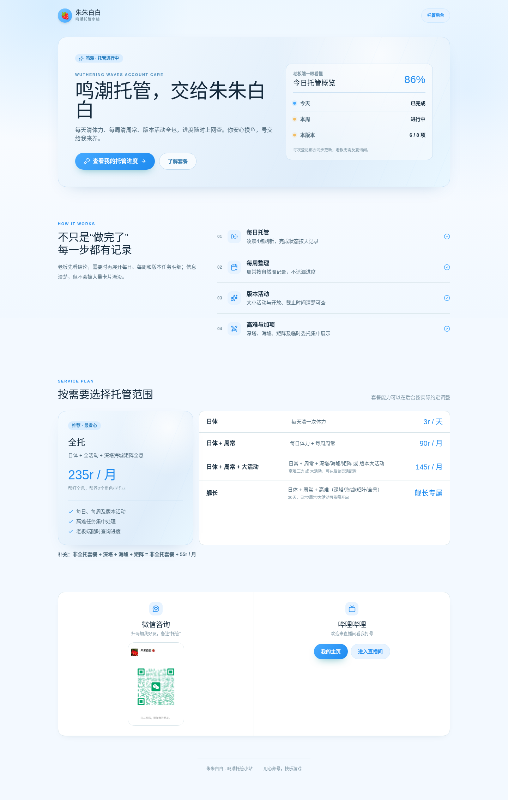
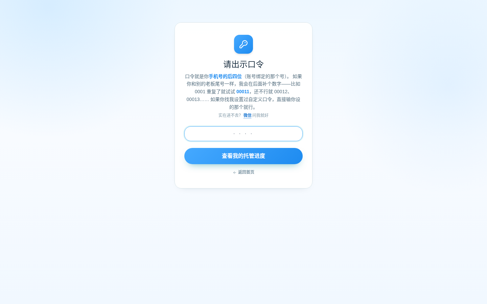
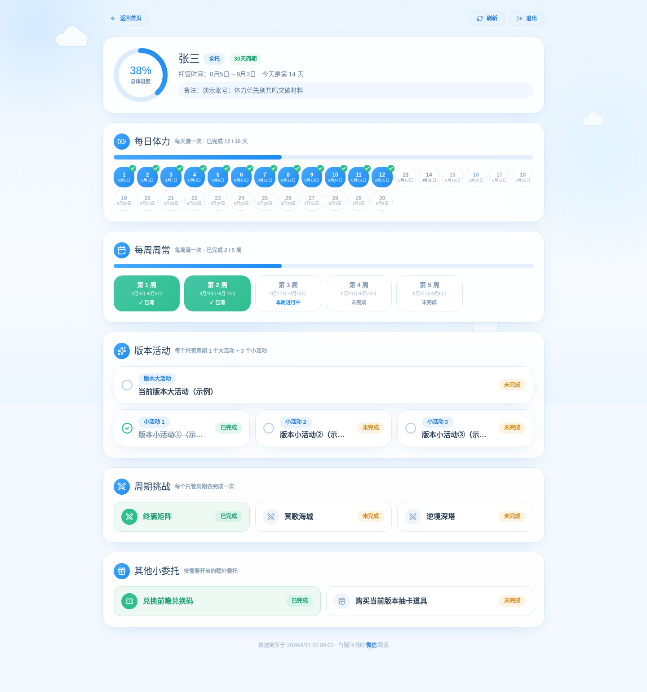
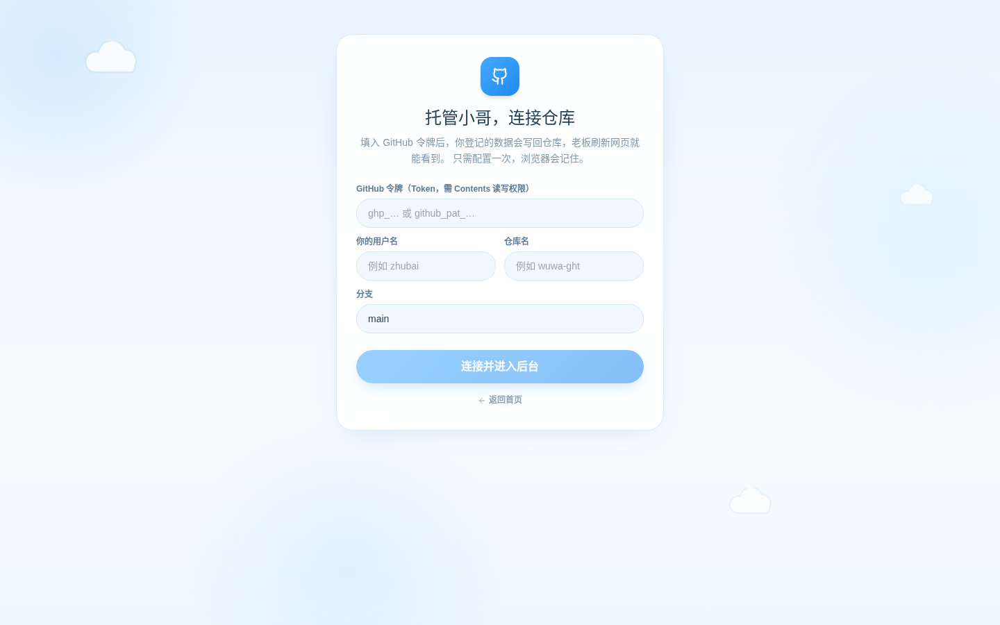
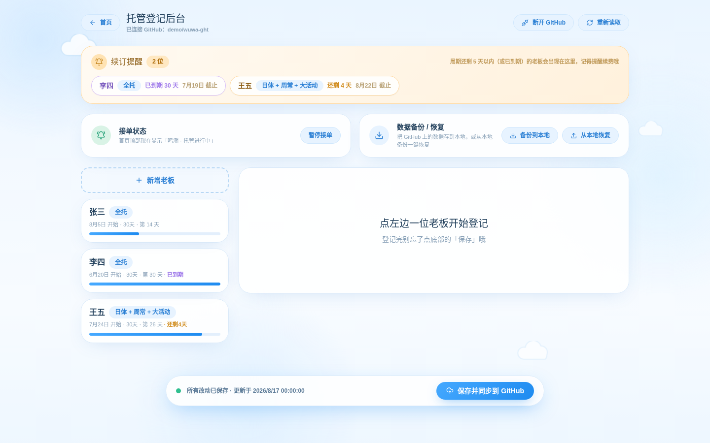
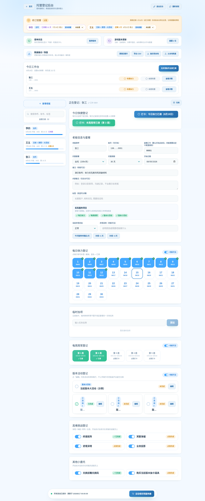
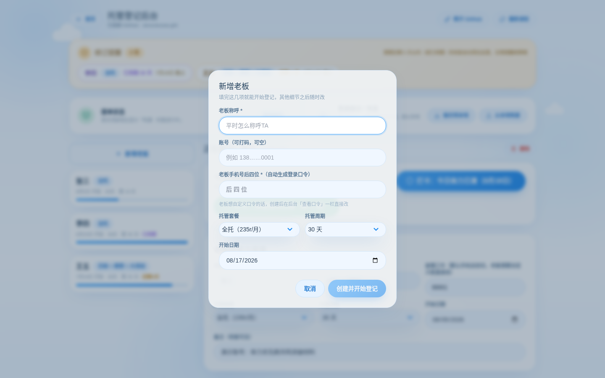
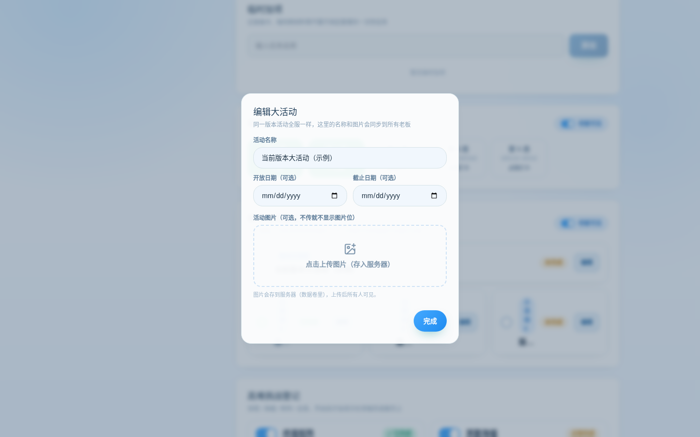

# 鸣潮托管记录站（朱朱白白）

一个给游戏托管（代肝）用的记录展示小站：老板凭口令上网查自己账号的托管进度，代肝在后台一键登记每日/每周/活动完成情况。

## 功能一览

**老板端（无需注册）**
- 输入口令（默认手机号后四位，可自定义）查看自己的托管进度
- 每日体力、每周周常、版本大小活动、终焉矩阵/冥歌海城/逆境深塔的完成情况一目了然
- 周期到期后显示「本周期已结束」，历史记录保留可查

**代肝后台**
- 今日快捷登记：一键勾掉今日体力、本周周常
- 新增老板三步走：称呼 → 手机尾号（自动生成口令，重复自动补位）→ 套餐/周期
- 托管周期支持 30 天 / 一个版本 42 天 / 自定义任意天数
- 续订提醒：周期还剩 5 天以内（含已到期）的老板自动置顶提醒
- 一键续期：到期老板一键开启新周期，打卡清零、活动名称和图片保留
- 活动名称和图片随时改，图片可选（不传不显示空框）；同一版本活动全服一样，名称/图片改一处自动同步所有老板
- 周常按真实日历周（周一~周日）展示，和游戏刷新节奏一致
- 套餐除四档常规规格外，另有「舰长」规格（日体 + 周常 + 大活动，30 天）
- 后台凭密码进入，无免密试用入口
- 接单状态开关：一键切换首页「托管进行中 / 暂时停止接单」徽章
- 数据备份到本地 / 从本地一键恢复，搬家换部署方式也不怕

**展示页**
- 托管价格表、服务内容、B 站主页/直播间、微信联系方式（悬停显示二维码）

## 界面预览

后台没有免密试用入口，这里放几张实际界面截图，想部署的人可以先看看长什么样。

**老板端**

| 首页（展示 + 价格表） | 口令登录 |
| --- | --- |
|  |  |

| 老板进度页（每日 / 周常 / 活动 / 挑战一目了然） |
| --- |
|  |

**代肝后台**

| 后台登录（凭密码 / Token，无免密试用） | 后台总览（续订提醒 + 老板列表） |
| --- | --- |
|  |  |

| 老板编辑器（快捷打卡 + 全部登记项） |
| --- |
|  |

| 新增老板（手机尾号自动生成口令） | 活动编辑（名称/图片全服同步） |
| --- | --- |
|  |  |

## 两种部署方式（同一份代码，自动识别）

| | GitHub Pages 版 | 服务器版（Docker） |
| --- | --- | --- |
| 数据存哪 | GitHub 仓库 `public/data.json` | 服务器本地卷 `/data` |
| 后台登录 | GitHub Token（Contents 读写） | 管理密码 `ADMIN_PASSWORD` |
| 保存生效 | 约 1~2 分钟（Pages 重新部署） | 立即生效 |
| 适合谁 | 零成本长期使用 | 有服务器、想自己掌控数据 |

### GitHub Pages

仓库已自带 `.github/workflows/deploy.yml`：Settings → Pages → Source 选 **GitHub Actions**，push 后自动构建部署。首次运行 `configure-pages` 会自动帮你开启 Pages。

### 服务器（Docker）

```bash
docker compose up -d   # 先改 docker-compose.yml 里的 ADMIN_PASSWORD
```

或纯 Docker：

```bash
docker build -t wuwa-ght .
docker run -d --name wuwa-ght -p 80:80 \
  -e ADMIN_PASSWORD=换成你自己的管理密码 \
  -v wuwa-data:/data \
  wuwa-ght
```

数据（`data.json` + 活动图片）都在 `/data` 卷里，备份用 `docker cp wuwa-ght:/data ./备份` 或后台「备份到本地」按钮。

## 技术栈

React 19 + TypeScript + Vite + Tailwind CSS + shadcn/ui；服务器版用零依赖 Node 小服务（`server.js`）托管页面和数据接口，不需要装数据库。

## 本地开发

```bash
npm install
npm run dev
npm run build   # 产物在 dist/
```

## 更换微信二维码

首页微信二维码固定读取 `public/wechat-qr.jpg`。以后换二维码不用改代码：在仓库页面点进 `public` 文件夹 → 点 `wechat-qr.jpg` → 右上角替换/删除后重新上传**同名文件**即可。

## 安全说明

老板口令是轻量保护：Pages 版仓库数据理论上可被直接读取，服务器版数据读取接口公开（老板端要查）。账号信息请保持打码，口令不要和其他重要账号通用。
